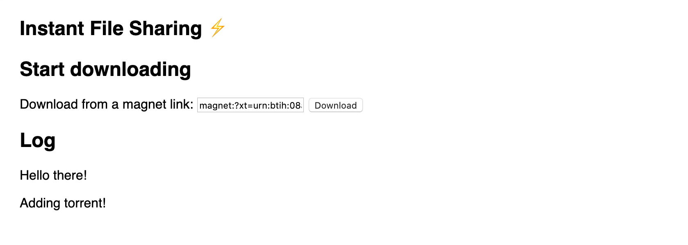

# 2 - Add the ability to download torrents

Add a form to the page which lets the user specify a torrent to download. The user should be able to specify a torrent identifier like a magnet link in an `<input>` element and click <btn>Submit</btn> to make WebTorrent start downloading it.

This is how we'll implement the functionality of receiving a file from another user. Later, we will add the ability to share files. The file transfer will take place over WebTorrent, which means that the data goes directly between users, without passing through a central server.

## Tips

Let's add a section to the page that shows a form:

```html
<section>
  <h1>Start downloading</h1>
  <form id='download'>
    <label for='torrentId'>Download from a magnet link:</label>
    <input name='torrentId' id='torrentId' placeholder='magnet:' required />
    <button type='submit'>Download</button>
  </form>
</section>
```

Let's discuss a few things about this code.

The `id='download'` attribute on the `<form>` will help us easily find this element from our JavaScript code using the `document.querySelector()` function. This will be very handy.

The `for='torrentId'` attribute on the `<label>` element lets us tell the browser that this label describes the `<input>` element with `name='torrentId'`. This helps browser accessibility tools (like screen readers) to understand what the `<input>` field is for.

Our `<input>` also has an `id='torrentId'` attribute so we can select it from JavaScript. The `required` attribute tells the browser that the form can't be submitted unless this input field is filled out.

Finally the `<button>` has a `type='submit'` attribute so that it submits the form when clicked.

Now let's initialize a WebTorrent client. Add a "global" variable to hold the WebTorrent client. Add this to the top of your JavaScript code, outside of any functions. This ensures that all functions can access the variable.

```js
let client
```

Then, add this to your `init()` function:

```js
// Create a WebTorrent client
client = new WebTorrent()
```

Next, let's log out any `warning` or `error` events that may occur. This will make debugging easier and it will also provide feedback to the user about what is happening. Add this to your `init()` function:

```js
// Log when a warning or error occurs
client.on('warning', logError)
client.on('error', logError)
```

The `on()` function is how you register interest in particular "events" in Node.js. While it's true that we're running this code in a browser, WebTorrent runs in both Node.js and the browser and often uses Node.js conventions.

In this case, we're saying we want the `logError` function to be called any time a `'warning'` or `'error'` event occurs. The function will be called with an `Error` which contains information about the type of issue that occurred. Warnings are informational and don't necessarily indicate a problem, while errors are fatal and will result in the whole WebTorrent client being destroyed.

Next, let's make that download button work! We'll add another event listener to listen for when the form is submitted. Add this to your `init()` function:

```js
// Download torrent when download form is submitted
const download = document.querySelector('#download')
download.addEventListener('submit', event => {
  event.preventDefault()
  const torrentId = document.querySelector('#torrentId').value.trim()
  addTorrent(torrentId)
})
```

The `document.querySelector()` function allows us to find elements on the page by specifying a "CSS selector". In this case, we're looking for the element matching `#download`. The hash symbol `#` means we want an element with an `id` of `'download'`, which just happens to be the download form we created earlier!

Next, we listen for the `'submit'` event on the form. When the form is submitted, our function will be called. We call `event.preventDefault()` to prevent the browser's default behavior when a form is submitted, which is to load a whole new webpage. We select the input with the user's magnet link, get the `value` within the input field, and trim any extra spaces that may exist before or after the user's text.

Finally, we call an `addTorrent()` function which we're about to implement!

Write a new function called `addTorrent` which just adds the user's magnet link to the WebTorrent client and logs a message indicating this!

```js
function addTorrent (magnetUrl) {
  client.add(magnetUrl)
  log('Adding torrent!')
}
```

## Verify

Try adding a magnet link and confirm that the message "Adding torrent!" appears in the log without any error messages! You can find a number of different torrent files and magnet links to test with on [this page](https://webtorrent.io/free-torrents).

Here's the magnet link for Sintel for your convenience:

```
magnet:?xt=urn:btih:08ada5a7a6183aae1e09d831df6748d566095a10&dn=Sintel&ws=https%3A%2F%2Fwebtorrent.io%2Ftorrents%2F&xs=https%3A%2F%2Fwebtorrent.io%2Ftorrents%2Fsintel.torrent
```

Try adding this magnet link and confirm that your page looks something like this:



If you are stuck, [read the solution](https://codepen.io/ferossity/pen/XWmLPyj).

When you are ready, [go to the next exercise](03.md).
